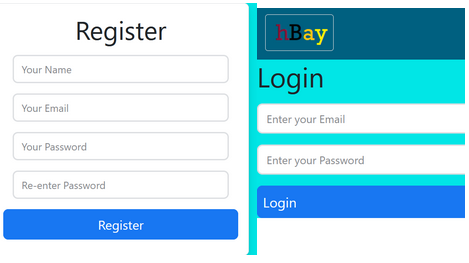

## hBay -Hostel Bay

<br />

<div align="center">

  <h3 align="center">Hostel Bay</h3>
A web App for buying /selling old stuff used in everyday hostel life
</div>

## Installation

1.  Clone the repo
    ```sh
    git clone https://github.com/Parasmanithakur/hBay.git
    ```
2.  Install NPM packages

    ```sh
    npm install
    ```

3.  Run app.js From server with nodemon

    ```
    cd .\server
    nodemon app.js
    ```

4.  Run the react app

    ```
    cd .\client
    npm start
    ```


Login or singup easily



### Built With


